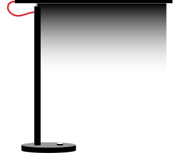

# Yeelight 🔥 Font Awesome duotone icons for Home Assistant

Created to be used with [hass-fontawesome](https://github.com/thomasloven/hass-fontawesome). 

[)](https://github.com/home-assistant)

Made by: 
- unpacking yeelight app .apk 
- and browsing through the thousands of files
- tracing them in vector
- converting to font-awesome format

<table>
  <tr>
    <td align="center"></td> 
    <td align="center"></td>
    <td align="center"></td>    
    <td align="center"></td>
    <td align="center"></td>
    <td align="center"></td>
    <td align="center"></td>
    <td align="center"></td>    
    <td align="center"></td>
    <td align="center"></td>
    <td align="center"></td>
    <td align="center"></td>
  </tr>   
</table>

## Usage

change icon to `fapro:yeelight-filename`, ie. `fapro:yeelight-gu10`. Supports all *hass-fontawesome* features: 
- `fapro:yeelight-gu10`
- `fapro:yeelight-gu10#invert`
- `fapro:yeelight-gu10#color`
- `fapro:yeelight-gu10#color-invert`
- `fapro:yeelight-gu10#fullcolor`

## ✨ Extra

Some icons have linear gradients or glows in `#fullcolor` mode:
- filament
- bar-front, bar-back
- desk

## Icons

Made for what I have at home. 
If you'd like to request a new icon, I will create it based on the device you send me. 😉

<table>
  <tr>
    <td align="center"></td>    
    <td align="center"></td>
    <td align="center"></td>    
    <td align="center"></td>
  </tr>
  <tr>
    <td align="center"><h4>🔥</h4></td>    
    <td align="center"><h4>Bulb Group</h4></td>
    <td align="center"><h4>Generic YLDP*YL Bulb</h4></td>
    <td align="center"><h4>Filament Bulb YLDP23YL</h4></td>
  </tr>
  <tr>
    <td align="center"></td>
    <td align="center"></td>
    <td align="center"></td>
    <td align="center"></td>    
  </tr>
  <tr>
    <td align="center"><h4>GU10 YLDP004-A</h4></td>
    <td align="center"><h4>Strip YLDD*YL</h4></td>
    <td align="center"><h4>Desk lamp MJTD01YL</h4></td>
    <td align="center"><h4>Candela YLFW01YL</h4></td>    
  </tr>
  <tr>
    <td align="center"></td>
    <td align="center"></td>
    <td align="center"></td>
    <td align="center"></td>
  </tr>  
  <tr>
    <td align="center"><h4>Bedside MJCTD01YL</h4></td>
    <td align="center"><h4>Bedside YLCT01YL</h4></td>    
    <td align="center"><h4>Light Bar Pro YLTD003 (front)</h4></td>
    <td align="center"><h4>Light Bar Pro YLTD003 (back)</h4></td>
  </tr>  
</table>

###### This work is licensed under a [Creative Commons Attribution-NonCommercial-ShareAlike 4.0 International License][cc-by-nc-sa].

[![CC BY-NC-SA 4.0][cc-by-nc-sa-shield]][cc-by-nc-sa]

[cc-by-nc-sa]: http://creativecommons.org/licenses/by-nc-sa/4.0/
[cc-by-nc-sa-image]: https://licensebuttons.net/l/by-nc-sa/4.0/88x31.png
[cc-by-nc-sa-shield]: https://img.shields.io/badge/License-CC%20BY--NC--SA%204.0-lightgrey.svg
